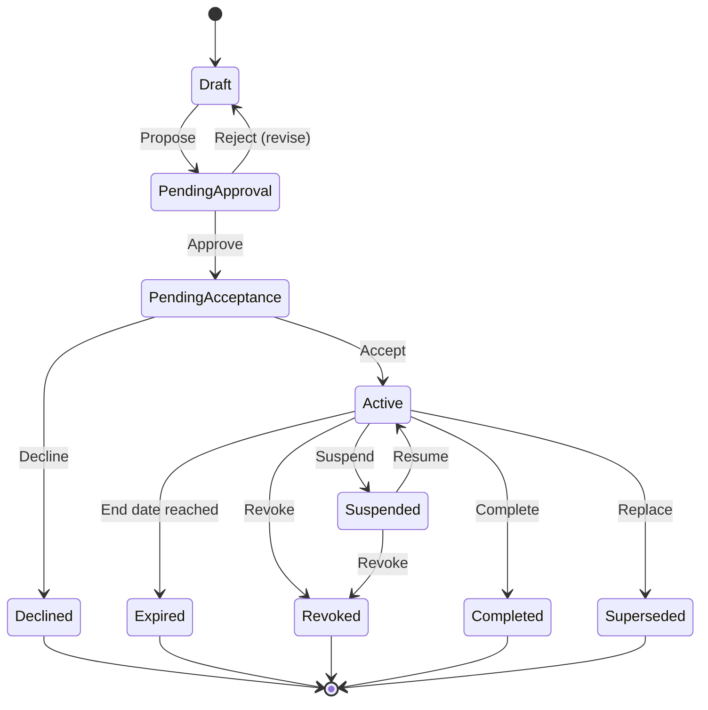

# PMMS Assignment Model

**Status:** Draft Complete — Pending Security, Domain, and Stakeholder Validation
**Related:** [phase-0.3-access-and-assignment-architecture.md](phase-0.3-access-and-assignment-architecture.md) · [role-catalog.md](role-catalog.md) · [scope-model.md](scope-model.md) · [authorization-decision-model.md](authorization-decision-model.md)

An Assignment is the time-bound relationship that **activates** a Role's capabilities within a specific Scope for a specific User Account. Per working rule 14, a Role and an Assignment are never the same concept: a Role is a reusable description ("Tournament Manager"); an Assignment is the fact that a specific person holds that role, in a specific scope, for a specific period, granted by a specific authority.

---

## 1. Assignment Purpose

Assignments exist to answer: *who, doing what, where, and until when* — separately from *what that role is generally capable of* (the Role) and *what specific actions it unlocks* (Permissions). This separation is what allows the same Role (e.g., Technical Official) to be held by hundreds of different people across dozens of meets without creating a role explosion, and what allows one person to hold meaningfully different authority in Meet A versus Meet B without those authorities bleeding into each other.

## 2. Assignment Types

| Assignment Type | Example | Typical Scope |
|---|---|---|
| Organizational assignment | Organization Administrator for DepEd | Organization |
| Meet assignment | Meet Director for Meet 2027 | Meet |
| Committee assignment | Secretariat Staff, Meet 2027 | Meet + Committee |
| Delegation assignment | Delegation Head, School X, Meet 2027 | Meet + Delegation |
| Sport assignment | Tournament Manager, Basketball, Meet 2027 | Meet + Sport |
| Event assignment | Result Certifier, Athletics Track Events | Meet + Sport + Event |
| Venue assignment | Medical Officer, Venue 2 | Meet + Venue |
| Tournament assignment | Draw approval authority for a specific bracket | Meet + Sport + Tournament |
| Official assignment | Technical Official, Match #14 | Meet + Sport + Event/Match |
| Shift assignment | Access Control Operator, Gate 1, July 15 AM shift | Meet + Venue + Device + Shift |
| Device assignment | A scanner bound to a specific gate/operator pairing | Venue + Device |
| Temporary acting assignment | Acting Meet Director while the Director is unavailable | Inherits the substituted assignment's scope |
| Emergency assignment | Emergency Medical Access during a declared incident | Meet + Venue (time-boxed, narrow) |
| Support assignment | A time-limited impersonation session | User-specific, session-bound |

## 3. Assignment Fields (Conceptual)

Every assignment type carries the following conceptual fields (no database schema implied):

| Field | Meaning |
|---|---|
| Subject | The User Account receiving the assignment |
| Role | The Role being activated |
| Scope | The specific scope instance(s) — e.g., "Basketball" not "Sport" in the abstract |
| Meet | The meet this assignment applies to (where applicable) |
| Organization | The organization this assignment applies to (where applicable) |
| Start date/time | When the assignment becomes eligible to be Active |
| End date/time | When the assignment's authority ceases (may be open-ended for organizational assignments, always bounded for meet-scoped ones) |
| Status | Current lifecycle state (Section 4) |
| Assigning authority | Who granted this assignment — itself a User Account with the appropriate permission (e.g., `official-assignment.create`) |
| Acceptance requirement | Whether the subject must explicitly accept before the assignment activates (e.g., a Technical Official accepting a match assignment) |
| Conflict declaration | Whether the subject has declared a conflict of interest relevant to this assignment |
| Reason | Why this assignment was created (required for sensitive/emergency assignments) |
| Source document reference | Link to the appointment memo, committee resolution, or other evidentiary basis, where applicable |
| Revocation authority | Who may revoke this assignment (may differ from the assigning authority — e.g., a Security Administrator can revoke any assignment in an emergency) |
| Delegation restrictions | Whether the subject may further delegate any part of this assignment's authority (default: no, per Section 21 of the main document) |
| Audit requirements | Standard for routine assignments; Elevated/Critical for high-integrity roles (Result Certifier, Eligibility Approver, Medal Tally Certifier) |

## 4. Assignment Lifecycle



**Not all assignment types pass through every state.** A low-stakes assignment (e.g., a Media Content Manager) may skip `PendingApproval`/`PendingAcceptance` and go straight from `Draft` to `Active` on creation; a high-integrity assignment (e.g., Result Certifier, Eligibility Approver) should always pass through explicit approval and, where the role requires personal accountability, explicit acceptance.

**Lifecycle actions:** Propose, Approve, Accept, Activate, Suspend, Resume, Extend, Replace, Revoke, Complete, Supersede. Each action is itself a permission-gated operation (see [permission-catalog.md](permission-catalog.md) for the pattern — specific assignment-management permissions are a Phase 0.4+ implementation concern, not enumerated exhaustively here).

**History preservation is mandatory** — an assignment's full lifecycle history (every state transition, actor, timestamp, reason) is retained even after the assignment reaches a terminal state, consistent with the "no silent mutation" principle from [high-integrity-domain-rules.md](high-integrity-domain-rules.md). This is what makes historical accountability possible (e.g., "who was the Result Certifier for this event at the time this result was certified" must be answerable years later).

## 5. Multiple and Concurrent Assignments

A single User Account may hold many simultaneous assignments, and this is the **normal**, expected case, not an edge case:

- A user may serve as Tournament Manager for Basketball in Meet 2027 **and** as a Delegation Head for their own school in the same meet — two separate assignments, two separate scopes, evaluated independently.
- A user may hold committee membership in more than one committee (e.g., both ICT and Security) if their real-world responsibility genuinely spans both — again, two separate assignments.
- A Technical Official may be assigned to multiple events within the same sport, or (per [Phase 0.1 organizational questions](../00-product/phase-0.1-product-foundation.md#16-organizational-model)) across sports, if real officiating practice supports it — each such assignment is distinct.
- A user may hold an Organization-level role (e.g., Organization Data Steward) **and** a Meet-level role (e.g., Meet Director for a specific meet) concurrently — these compose (per [scope-model.md, Section 3](scope-model.md#3-scope-composition-and-intersection)) rather than merge into one undifferentiated "super-authority."
- A user may be temporarily **acting** for another officer (Section 6 below).
- A user may be assigned to multiple venues (e.g., an ICT Coordinator supporting two venues).

**Concurrent assignment does not automatically merge all authority across scopes.** Each assignment's scope remains independently evaluated at request time — holding a Basketball Tournament Manager assignment and a Volleyball Delegation Head assignment does not let the user certify a Volleyball result, because `official-result.certify` requires a Result Certifier assignment scoped to that specific sport, which this user does not hold.

**Assignment schedule conflicts** (e.g., two Venue+Shift assignments that overlap in time for the same physical presence requirement) should be detected at assignment-creation time as a validation warning, not silently allowed — the specific conflict-detection mechanism is a later-phase (application) concern.

**Maximum concurrent assignment rules** (e.g., "no user may hold more than N active high-integrity assignments simultaneously") are **not defined in Phase 0.3** — this requires stakeholder input on realistic staffing patterns and is recorded as an open decision (see [access-open-decisions.md](access-open-decisions.md)).

## 6. Temporary and Acting Assignments

An **Acting Assignment** allows one user to temporarily hold another (named) assignment's authority — e.g., an Assistant Tournament Manager acting as Tournament Manager while the primary is unavailable. Rules:

- An acting assignment references the specific assignment it substitutes for, not a freestanding grant of the role in the abstract.
- An acting assignment carries the same scope as the assignment it substitutes for — it cannot be broader.
- An acting assignment is time-boxed and requires the same (or higher) approval authority as the original assignment.
- The original assignment is **suspended**, not revoked, for the acting period, and automatically resumes (or requires explicit resumption, per validation) when the acting period ends.
- Acting assignments for high-integrity roles (Result Certifier, Eligibility Approver, Medal Tally Certifier) require Elevated audit treatment — the fact that authority temporarily passed to a different individual must be as visible in the historical record as who held it normally.

## 7. Emergency Assignments

An Emergency Assignment grants narrow, time-boxed authority in a declared emergency (e.g., a substitute Medical Officer during a mass-casualty incident). See [phase-0.3-access-and-assignment-architecture.md, Section 31](phase-0.3-access-and-assignment-architecture.md#31-emergency-and-break-glass-access) for the full break-glass policy this assignment type implements. Emergency assignments always require: explicit reason, limited duration, limited scope, elevated audit logging, and automatic expiry — never an indefinite grant.

## 8. Delegated Authority

By default, an assignment's authority is **not** further delegable by its holder — a Tournament Manager cannot, on their own initiative, grant Tournament Manager authority to someone else. Creating a new assignment for a new person is itself a permission-gated action (`official-assignment.create` and equivalents in [permission-catalog.md](permission-catalog.md)), performed by whoever holds the *assigning* authority for that role (see [role-catalog.md](role-catalog.md) — Head-level committee roles typically hold this, Staff-level roles typically do not). This prevents uncontrolled authority sprawl through informal hand-offs.

## 9. Assignment Conflicts

Two categories of conflict are checked at assignment-creation time:

1. **Separation-of-duties conflicts** — e.g., attempting to assign the same person as both Eligibility Reviewer and Eligibility Approver for the same delegation in the same case. See [separation-of-duties-matrix.md](separation-of-duties-matrix.md) for the full list.
2. **Schedule/capacity conflicts** — e.g., assigning the same Technical Official to two matches scheduled at overlapping times in different venues.

Both categories should be surfaced as warnings/blocks at assignment-creation time; neither is resolved automatically or silently.

## 10. Post-Meet Expiry

Meet-scoped assignments (Committee, Delegation, Sport, Event, Venue, Tournament, Shift, Device) are expected to expire automatically at meet closure (`MeetClosed` event, see [domain-events-catalog.md](domain-events-catalog.md)) unless explicitly extended for post-meet activities (e.g., a Secretariat Staff assignment needed briefly for final report compilation). Organization-level assignments do not expire at meet closure, since they are not meet-scoped to begin with.

## 11. Conceptual Examples

### Example 1
```text
Role: Tournament Manager
Assignment: Tournament Manager for Basketball, Provincial Meet 2027
Scope: Meet 2027 + Basketball
```

### Example 2
```text
Role: Eligibility Reviewer
Assignment: Eligibility Reviewer for Delegations A–D, Meet 2027
Scope: Meet 2027 + assigned delegations
```

### Example 3
```text
Role: Medical Staff
Assignment: Medical Team member at Venue 2, July 15–18
Scope: Meet + Venue 2 + assigned shift
```

### Example 4
```text
Role: Result Certifier
Assignment: Certifier for Athletics Track Events
Scope: Meet + Athletics + Track Events
```

### Example 5
```text
Role: Access Control Operator
Assignment: Gate Scanner Operator at Main Stadium Gate 1
Scope: Venue + gate + assigned device + shift
```

These same five examples anchor the "Role Versus Assignment" discussion in [phase-0.3-access-and-assignment-architecture.md, Section 15](phase-0.3-access-and-assignment-architecture.md#15-role-versus-assignment-examples) and are cross-referenced from [role-catalog.md](role-catalog.md) wherever a role's typical assignment pattern is described.

## 12. Open Questions

- Maximum concurrent high-integrity assignments per user (Section 5).
- Whether acting assignments require explicit resumption or auto-resume (Section 6).
- Specific evidentiary/source-document requirements per assignment type (e.g., does a Delegation Head assignment require a school-issued appointment letter, and who verifies it) — depends on DepEd governance not yet documented.

Tracked in [access-open-decisions.md](access-open-decisions.md).
