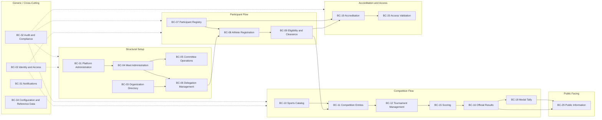
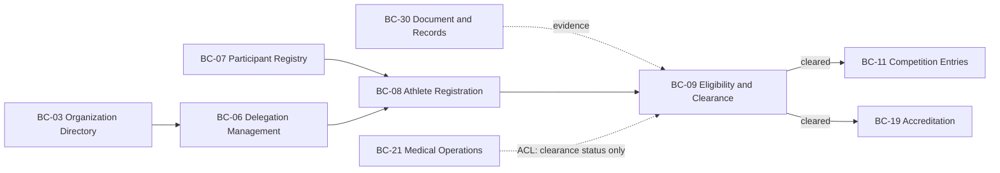
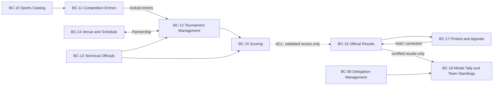
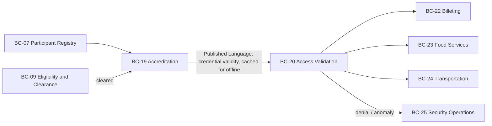
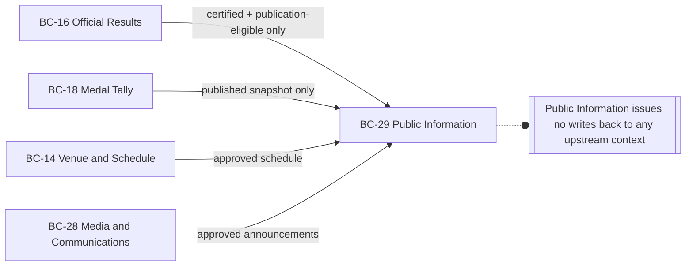
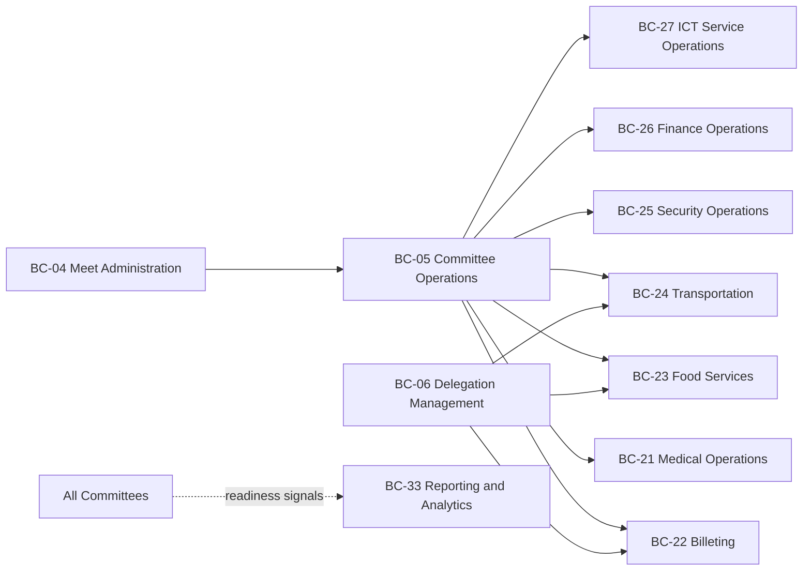

# PMMS Context Map

**Status:** Draft Complete — Pending Domain and Stakeholder Validation
**Related:** [bounded-context-catalog.md](bounded-context-catalog.md) · [data-ownership-map.md](data-ownership-map.md) · [offline-and-synchronization-boundaries.md](offline-and-synchronization-boundaries.md)

This document maps relationships between PMMS bounded contexts using standard strategic-DDD patterns: Customer–Supplier, Conformist, Anti-Corruption Layer (ACL), Published Language, Open Host Service (OHS), Partnership, and Separate Ways. **Shared Kernel is avoided everywhere except one narrow, explicitly justified case** (BC-34 Configuration and Reference Data, described below as a Published Language rather than a true mutable Shared Kernel).

## Written Context Map

PMMS's contexts form a rough pipeline along the meet lifecycle, with several generic/cross-cutting contexts (Identity and Access, Audit and Compliance, Notifications, Configuration and Reference Data) acting as horizontal Open Host Services consumed by nearly everything else:

1. **Identity and structural setup** flows from Platform Administration → Meet Administration → Organization Directory → Committee Operations / Delegation Management.
2. **Participant flow** runs Participant Registry → Athlete Registration → Eligibility and Clearance → (Competition Entries and Accreditation branch from here).
3. **Competition flow** runs Sports Catalog + Competition Entries → Tournament Management → Scoring → Official Results → (Medal Tally and Protest & Appeals branch from here).
4. **Access flow** runs Accreditation → Access Validation, consumed by Billeting, Food Services, Transportation, and Security Operations at the point of physical access.
5. **Publication flow** runs from Official Results, Medal Tally, Venue and Schedule, and Media and Communications → Public Information (strictly one-directional; Public Information never writes back upstream).
6. **Cross-cutting concerns** — Identity and Access, Audit and Compliance, Notifications, Document and Records, and Configuration and Reference Data — are consumed horizontally by most other contexts rather than sitting in the pipeline.
7. **Reporting and Analytics** sits downstream of everything as a pure read-only consumer.

## Relationship Matrix

| Upstream | Downstream | Pattern | Data Exchanged | Direction | Interaction Style | Consistency | Failure Behavior | Security | Offline Implications |
|---|---|---|---|---|---|---|---|---|---|
| BC-01 Platform Administration | BC-04 Meet Administration | Conformist | Platform policy, feature availability | One-way | Config read | Eventual | Meet Admin uses last-known config | Admin-only write | None |
| BC-03 Organization Directory | BC-06 Delegation Management | Customer–Supplier | Organization/school identity | One-way | Reference lookup | Eventual (cached) | Delegation registration blocked if org unresolved | Read-scoped | Low — cached reference |
| BC-04 Meet Administration | Nearly all meet-scoped contexts | Open Host Service / Published Language | Meet identity, lifecycle state (active/closed) | One-way | Conformance check | Strong (must reflect current meet status for write operations) | Writes rejected if meet not active | Enforced at write boundary | Meet status must be cached for offline validation |
| BC-02 Identity and Access | All contexts (actor identity) | Open Host Service | Authenticated actor identity, session validity | One-way | Conformance | Strong for admin actions; eventual for cached mobile sessions | Session invalid → re-auth required | Central | Cached session tokens with expiry for field devices |
| BC-07 Participant Registry | BC-08 Athlete Registration, BC-13, BC-19, BC-21 | Customer–Supplier, Open Host Service | Canonical participant identity | One-way | Reference + event | Eventual (with reconciliation) | Registration proceeds with provisional identity pending resolution | Restricted (PII) | Low — identity cached locally, corrections sync |
| BC-06 Delegation Management | BC-08 Athlete Registration | Customer–Supplier | Delegation membership context | One-way | Reference | Eventual | Registration blocked without confirmed delegation | Scoped | Low |
| BC-08 Athlete Registration | BC-09 Eligibility and Clearance | Customer–Supplier | Registration submission triggering eligibility case | One-way | Event-triggered | Eventual (case created asynchronously) | Case creation retried on failure | Restricted | None |
| BC-21 Medical Operations | BC-09 Eligibility and Clearance | **Anti-Corruption Layer** | Minimal clearance-status flag only (not raw medical records) | One-way | Status reference via ACL | Eventual | Eligibility treats missing status as "pending," never auto-approves | Highly restricted | None — ACL never crosses offline boundary |
| BC-30 Document and Records | BC-09 Eligibility and Clearance | Customer–Supplier | Document metadata (evidence references) | One-way | Reference | Eventual | Case can be reviewed once documents confirmed uploaded | Scoped | Low |
| BC-09 Eligibility and Clearance | BC-11 Competition Entries | Customer–Supplier | Eligibility-cleared status | One-way | Gate check | **Strong** (entry cannot be confirmed for a non-cleared participant) | Entry submission blocked/held | Restricted | None |
| BC-09 Eligibility and Clearance | BC-19 Accreditation | Customer–Supplier | Eligibility-cleared status (accreditation precondition) | One-way | Gate check | Strong | Accreditation request held | Restricted | None |
| BC-10 Sports Catalog | BC-11 Competition Entries | Open Host Service / Published Language | Sport/event definitions | One-way | Reference | Eventual (versioned) | Entry uses last-published definition version | Scoped | Low — cached |
| BC-10 Sports Catalog | BC-12 Tournament Management | Open Host Service / Published Language | Sport/event format rules (source-referenced) | One-way | Reference | Eventual (versioned) | Draw generation blocked if format undefined | Scoped | Low — cached |
| BC-11 Competition Entries | BC-12 Tournament Management | Customer–Supplier | Confirmed, locked entries | One-way | Batch/event | Strong (locked entries are the seeding input) | Draw generation blocked until entries locked | Scoped | None |
| BC-12 Tournament Management | BC-14 Venue and Schedule | **Partnership** | Match list requiring slots ↔ available venue/time slots | Bidirectional | Negotiated | Strong (schedule must reflect actual competition structure) | Conflicts surfaced for manual resolution, not auto-resolved | Scoped | Medium — venue-level schedule cached for field devices |
| BC-12 Tournament Management | BC-13 Technical Officials | Customer–Supplier | Match/event assignments needed | One-way | Reference + event | Eventual | Match proceeds with provisional assignment pending confirmation | Scoped | Medium |
| BC-12 Tournament Management | BC-15 Scoring | Customer–Supplier | The match/heat being scored | One-way | Reference | Strong (score must attach to a valid competition unit) | Score entry blocked without valid match reference | Scoped | High — match reference cached at venue |
| BC-15 Scoring | BC-16 Official Results | **Anti-Corruption Layer (recommended)** | Validated raw scores translated into result-assembly input | One-way | Event-triggered translation | Strong (result assembly only reads validated scores) | Result assembly withheld until scores validated | Restricted | None — ACL translation happens server-side only |
| BC-16 Official Results | BC-17 Protest and Appeals | Customer–Supplier | Published/certified result subject to protest | One-way | Reference | Strong | Protest references an immutable result version | Restricted | Low |
| BC-17 Protest and Appeals | BC-16 Official Results | **Partnership** (reverse trigger) | Result hold / correction instruction | Bidirectional | Event-triggered | Strong | Result publication frozen while hold is active | Restricted | None |
| BC-16 Official Results | BC-18 Medal Tally and Team Standings | Customer–Supplier, Published Language | Certified official results only | One-way | Event-triggered | Strong (tally never reads unvalidated scores) | Tally computation withheld until results certified | Restricted | None |
| BC-06 Delegation Management | BC-18 Medal Tally and Team Standings | Customer–Supplier | Delegation identity for team aggregation | One-way | Reference | Eventual | Aggregation deferred until delegation resolved | Scoped | None |
| BC-07 Participant Registry | BC-19 Accreditation | Customer–Supplier | Canonical identity for credential issuance | One-way | Reference | Strong (credential must bind to a resolved identity) | Issuance blocked on unresolved identity | Restricted | Low |
| BC-19 Accreditation | BC-20 Access Validation | Customer–Supplier, **Published Language** | Credential validity rules, cached credential set | One-way | Batch sync (pre-cached for offline) | Eventual (deliberately — see [offline-and-synchronization-boundaries.md](offline-and-synchronization-boundaries.md)) | Scanner falls back to last-synced credential set; flags conflicts | Restricted | **Critical** — this is the primary offline-first relationship in PMMS |
| BC-20 Access Validation | BC-22/23/24 (Billeting/Food/Transportation) | Customer–Supplier | Scan event confirming access | One-way | Event | Eventual | Local logistics record created, reconciled later | Scoped | High |
| BC-20 Access Validation | BC-25 Security Operations | Customer–Supplier | Access-denial/anomaly signals | One-way | Event | Eventual | Alert queued for later delivery if offline | Scoped | High |
| BC-14 Venue and Schedule | BC-29 Public Information | Customer–Supplier, Published Language | Approved public schedule projection | One-way | Projection sync | Eventual | Public shows last-published schedule | Public (approved data only) | N/A |
| BC-16 Official Results | BC-29 Public Information | Customer–Supplier, Published Language | Certified, published results only | One-way | Projection sync | Eventual (near-real-time target) | Public shows last-published result | Public (approved data only) | N/A |
| BC-18 Medal Tally | BC-29 Public Information | Customer–Supplier, Published Language | Published tally snapshot | One-way | Projection sync | Eventual | Public shows last-published tally | Public (approved data only) | N/A |
| BC-28 Media and Communications | BC-29 Public Information | Customer–Supplier | Approved announcements/advisories | One-way | Projection sync | Eventual | Public shows last-approved announcement | Public (approved data only) | N/A |
| All contexts | BC-32 Audit and Compliance | Open Host Service / Published Language | Audit event (actor, action, target, reason, timestamp) | One-way | Event | Eventual, but **durable** (never dropped) | Local buffering with guaranteed eventual delivery | Restricted (write-once) | Medium — local buffer required for offline-capable contexts |
| All contexts | BC-31 Notifications | Customer–Supplier | Notification intent | One-way | Event | Eventual | Retried with backoff; failure logged, not silently dropped | Scoped | Low |
| All contexts | BC-33 Reporting and Analytics | Customer–Supplier | Read-only projections | One-way | Batch/event sync | Eventual | Stale data flagged with last-refresh timestamp | Scoped by report | N/A |
| BC-34 Configuration and Reference Data | Most contexts | **Published Language** (not Shared Kernel) | Versioned shared enumerations/status vocabularies | One-way | Reference (cached, versioned) | Eventual | Consumers pin to a known reference-data version; a bad reference-data change cannot silently break dependents because consumers version-pin | Scoped | Low — cached |

## Why Shared Kernel Is Avoided

A true Shared Kernel (a codebase or schema jointly owned and directly mutated by multiple teams/contexts) is rejected everywhere in this map because it creates coupled deployment and coupled failure — a change by one context's team can silently break another. The one case that superficially resembles a Shared Kernel — **BC-34 Configuration and Reference Data** — is deliberately modeled as a **versioned Published Language** instead: consuming contexts read a specific, immutable version of a reference value rather than a live mutable shared table, so a change in BC-34 cannot retroactively alter another context's already-recorded decisions. This distinction is treated as an architectural principle, not just a naming choice (see [phase-0.2-domain-architecture.md, Section 8](phase-0.2-domain-architecture.md#8-data-ownership-principles)).

## Anti-Corruption Layers — Explicit Justification

Two relationships are explicitly called out as requiring an Anti-Corruption Layer, per working rule 22 (avoid shared mutable ownership) and the high-integrity requirements in [Phase 0.1](../00-product/phase-0.1-product-foundation.md#8-product-principles):

1. **Medical Operations → Eligibility and Clearance.** Eligibility must never hold or directly query raw medical records — it consumes a translated, minimal clearance-status concept. This protects Medical Operations' sensitive data model from leaking into a context with broader (Secretariat-level) access, and protects Eligibility from becoming an unintended second medical-data store.
2. **Scoring → Official Results.** Official Results must never read raw, in-progress, or unvalidated score data directly — it consumes only validated scores through a translation step that assembles results from confirmed inputs. This protects result certification from being contaminated by in-progress or corrected-in-place scoring data, and keeps Scoring free to iterate its capture model without breaking Results' certification guarantees.

## Diagrams

Diagrams are split by lifecycle stage to stay readable, per working rule instruction to avoid one unreadable diagram.

### 1. High-Level Context Landscape

### 2. Participant and Eligibility Flow

### 3. Tournament, Scoring, Results, and Medal Flow

### 4. Accreditation and Access-Validation Flow

### 5. Public Publication Flow

### 6. Logistics and Committee Coordination Flow

All diagrams use Mermaid `flowchart` syntax and should render in any Mermaid-compatible Markdown viewer (GitHub, GitLab, most documentation tooling).
