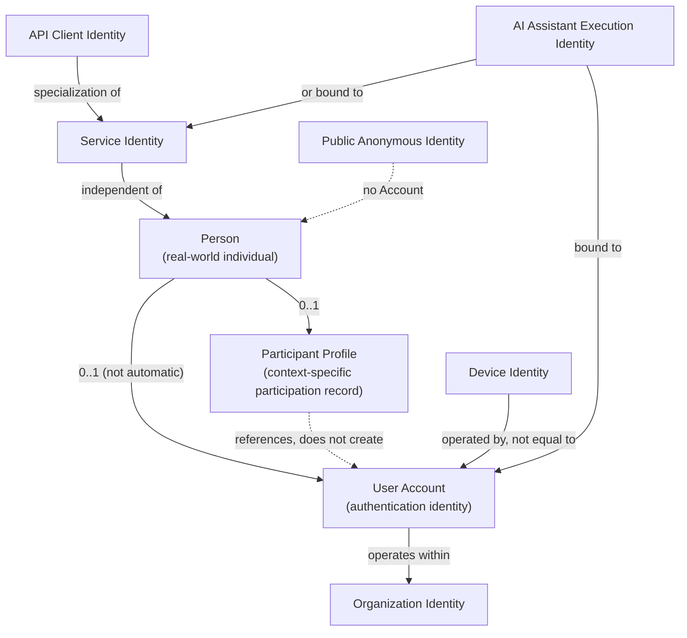

# PMMS Identity Model

**Status:** Draft Complete — Pending Security, Domain, and Stakeholder Validation
**Related:** [phase-0.3-access-and-assignment-architecture.md](phase-0.3-access-and-assignment-architecture.md) · [bounded-context-catalog.md](bounded-context-catalog.md#bc-07--participant-registry) · [domain-open-decisions.md, DD-01](domain-open-decisions.md#dd-01--participant-registry-vs-separate-athletecoachofficial-registries)

This document defines PMMS's conceptual identity model: the distinct kinds of "who" the platform must reason about, and how they relate. **Person, Participant Profile, and User Account are three distinct concepts and must never be conflated** — this is the foundational distinction the entire Phase 0.3 access model depends on.

---

## 1. Identity Categories

### Person
A real-world individual known to PMMS, independent of any system access or meet participation. Examples: an athlete, a coach, a tournament manager, a technical official, a committee member, a DepEd employee, a volunteer, a medical worker, a media representative, a driver, security personnel. **A person may exist without a user account** — e.g., a 12-year-old athlete has no login, but is fully known to the system through their Participant Profile. Owning context: [BC-07 Participant Registry](bounded-context-catalog.md#bc-07--participant-registry).

### Participant Profile
A context-specific representation of a person participating in a meet or holding an operational role. Examples: athlete participation profile, coach profile, technical official profile, delegation staff profile, committee participant profile, media participant profile. **Participant identity must not automatically create system access** — registering an athlete does not create a user account for that athlete. Owning context: [BC-07](bounded-context-catalog.md#bc-07--participant-registry) (canonical identity) with role-specific extension data owned by the consuming context (BC-08, BC-13, BC-05, etc., per [domain-open-decisions.md, DD-01](domain-open-decisions.md#dd-01--participant-registry-vs-separate-athletecoachofficial-registries)).

### User Account
A digital authentication identity that may sign in to PMMS. May be linked to a Person but remains a distinct concept. Examples: an athlete may have a Participant Profile but no User Account; a coach may have both; a scanner device has a Device Identity but no Person; a support account may exist without being an event participant at all. Owning context: [BC-02 Identity and Access](bounded-context-catalog.md#bc-02--identity-and-access).

### Organization Identity
The identity of an onboarded organization (initially DepEd; see [Phase 0.1 OD-02](../00-product/open-decisions.md#od-02--single-organization-versus-multi-organization)) or a node within its hierarchy (region, division, district, school). Owning context: [BC-03 Organization Directory](bounded-context-catalog.md#bc-03--organization-directory).

### Device Identity
A registered identity for a physical device acting on the platform's behalf (scanner, scoring station, kiosk). A device is never a substitute for a User Account — it carries its own identity, distinct from whichever staff member is operating it at a given moment. See [device-and-service-identity-model.md](device-and-service-identity-model.md).

### Service Identity (Machine Identity)
A non-human identity for a system process (queue worker, scheduled job, integration client, AI service, notification service). Service identities never silently act as a human approver. See [device-and-service-identity-model.md](device-and-service-identity-model.md).

### API Client Identity
A registered identity for an external or internal system consuming PMMS APIs (deferred integrations per [Phase 0.1 product-scope.md, Section 8](../00-product/product-scope.md#8-deferred-integrations)). Conceptually a specialization of Service Identity, scoped narrowly to the specific integration's data needs.

### Public Anonymous Identity
The absence of authentication — the default state of any visitor to the Public Information surface ([BC-29](bounded-context-catalog.md#bc-29--public-information-non-authoritative)). Not a "role" in the account sense; it is the baseline unauthenticated state, read-only by definition (see [phase-0.3-access-and-assignment-architecture.md, Section 22](phase-0.3-access-and-assignment-architecture.md#22-public-guest-and-self-service-access)).

### Support Operator Identity
A User Account belonging to platform support staff, distinguished from ordinary accounts by the additional (disabled-by-default) capability to request impersonation/support sessions. See [access-review-and-revocation.md](access-review-and-revocation.md) and the impersonation policy in the main document.

### System Process Identity
An internal identity for platform-initiated automated processes (e.g., a scheduled meet-readiness recalculation) that is not tied to any single Service Identity's external-facing credential. Distinguished from Service Identity primarily by audience (internal-only vs. potentially external-facing).

### AI Assistant Execution Identity
The identity under which an AI-assisted feature executes — **always bound to either a requesting User Account or an approved Service Identity, never a free-standing identity with its own independent authority.** See [phase-0.3-access-and-assignment-architecture.md, Section 29](phase-0.3-access-and-assignment-architecture.md#29-ai-authorization-boundary).

---

## 2. Relationships Among Identity Types

**Key relationship rules:**
- A Person **may** have zero, one, or (rarely, requiring review) more than one Participant Profile across different meets/roles — see historical identity preservation below and [domain-open-decisions.md, DD-18](domain-open-decisions.md#dd-18--historical-participant-identity).
- A Person **may** have zero or one User Account. PMMS does not require a User Account to be known to the system.
- A User Account **may** be linked to zero Persons (e.g., a pure support/admin account with no participation history) or exactly one Person — never many-to-many.
- A Device Identity is **operated by** a User Account during a session but is never itself a User Account; device trust and user authentication are evaluated as separate, combined inputs (see [device-and-service-identity-model.md](device-and-service-identity-model.md)).
- A Service Identity is **never** a Person and is never granted the authority to perform a human-approval action (e.g., no Service Identity may certify a result).
- An AI Assistant Execution Identity is **always** a derived/bound identity, never independently authoritative (see Section 29 of the main document).

---

## 3. Account Linking

Linking a User Account to a Person/Participant Profile is a deliberate, reviewable action, not an automatic side effect of registration:

- Registering an athlete (BC-08) creates a Participant Profile via BC-07 — it does **not** create a User Account.
- A coach may be issued a User Account separately, at the point the platform determines self-service access is warranted (e.g., entry submission), linked explicitly to their existing Person/Participant Profile.
- Linking requires a basis for confidence that the User Account and the Person are the same individual — the specific identity-proofing mechanism is deferred (see Section 8 below and [access-open-decisions.md](access-open-decisions.md)).

## 4. Duplicate Identities

Duplicate Person/Participant records are a named platform risk (RSK-02 in [Phase 0.1](../00-product/assumptions-constraints-risks.md)). The identity model requires:

- Duplicate-detection is advisory (AI-eligible), never automatic merge (per [high-integrity-domain-rules.md, Participant Identity](high-integrity-domain-rules.md#participant-identity--bc-07)).
- A duplicate User Account (two accounts controlled by the same person) is a **security** concern, distinct from a duplicate Participant record, and should be detectable through account-recovery and login-pattern review (mechanism deferred to a later phase).

## 5. Account Recovery Ownership

Account recovery (regaining access to a User Account) is owned by [BC-02 Identity and Access](bounded-context-catalog.md#bc-02--identity-and-access). For minors who may never hold their own User Account, recovery is not applicable to the Participant Profile — a guardian or delegation head's own Account recovery is what matters, since minors' data is accessed through the adult-held Account, not a login of their own (see Section 9, Minor Athlete Considerations).

## 6. Identity Lifecycle

| State | Applies To | Meaning |
|---|---|---|
| Provisional | Person, Participant Profile | Created but not yet confirmed/reviewed (e.g., pending duplicate-check) |
| Active | Person, Participant Profile, User Account, Device, Service | Normal operating state |
| Suspended | User Account, Device, Service | Temporarily disabled, reversible |
| Locked | User Account | Disabled due to security concern (e.g., failed authentication pattern), requires explicit unlock |
| Revoked | User Account, Device, Service, API Client | Permanently disabled; a new identity must be issued if access is needed again |
| Merged | Person, Participant Profile | Consolidated into another record following a reviewed duplicate-resolution decision (see [BC-07](bounded-context-catalog.md#bc-07--participant-registry)) |
| Archived | Person, Participant Profile, User Account | Retained for historical/audit purposes, no longer operationally active |

## 7. Identity Status

Distinct from lifecycle *state* above, identity *status* concepts that authorization decisions consume (see [authorization-decision-model.md](authorization-decision-model.md)):

- **Account status** (active/suspended/locked/revoked) — gates authentication itself.
- **Identity assurance level** — how confident the platform is that a User Account genuinely belongs to the claimed Person (see Section 8).
- **Verification status** — whether supporting identity evidence (for roles requiring it, e.g., Technical Official qualification) has been confirmed.

## 8. Identity Proofing Concept

Different identity types warrant different levels of proofing before being trusted with sensitive actions:

- **Low assurance:** self-registered accounts with only email/basic verification (e.g., a coach account before any in-person confirmation).
- **Medium assurance:** accounts confirmed through a delegation head, Secretariat, or committee onboarding process.
- **High assurance:** accounts for high-integrity roles (Result Certifier, Eligibility Approver) confirmed through a documented appointment/verification process before assignment activation.

**The specific proofing mechanism (document upload, in-person verification, DepEd employee ID validation) is not decided here** — this is an architecture-level concept requiring a later-phase (or Phase 0.3 open-decision) resolution; see [access-open-decisions.md](access-open-decisions.md).

## 9. Minor Athlete Considerations

Most PMMS athletes are likely minors (per [Phase 0.1 CON-09](../00-product/assumptions-constraints-risks.md#2-constraints)). The identity model treats this as a first-class concern:

- Minor athletes typically have a Participant Profile **without** a User Account.
- Access to a minor's data occurs through an adult's User Account (coach, delegation head, or — pending [Phase 0.1 OD-16](../00-product/open-decisions.md#od-16--parent-or-guardian-access) — a guardian account), never through a login issued directly to the minor, unless a future policy explicitly authorizes athlete self-service accounts for older participants.
- Any future athlete self-service capability (e.g., an "Athlete Portal") must apply age-appropriate identity-proofing and guardian-consent requirements — not decided in Phase 0.3.

## 10. Parent or Guardian Relationship

A Parent/Guardian identity, if implemented (pending [Phase 0.1 OD-16](../00-product/open-decisions.md#od-16--parent-or-guardian-access)), would be a User Account linked to a **verified relationship** with one or more Participant Profiles, not an independent Participant Profile itself. The relationship-verification mechanism is an open question — see [access-open-decisions.md](access-open-decisions.md).

## 11. Historical Identity Preservation

Consistent with [domain-open-decisions.md, DD-18](domain-open-decisions.md#dd-18--historical-participant-identity), a Person's identity is expected to persist across meet cycles rather than being re-created each time. This directly informs the Phase 0.3 requirement that a User Account may hold multiple, time-bound Assignments across different meets without needing a new identity per meet (see [assignment-model.md](assignment-model.md)).

## 12. Cross-Meet Identity Reuse

A single Person may hold a Participant Profile as an athlete in one meet and, in a later meet cycle, as a coach or technical official — the same canonical identity (BC-07), different role-specific extension data. This is the direct consequence of the DD-01 "shared registry" recommendation from Phase 0.2 and must not be re-litigated at the authorization layer.

## 13. Cross-Organization Identity Concerns

If PMMS later supports organizations beyond DepEd (per [Phase 0.1 OD-02](../00-product/open-decisions.md#od-02--single-organization-versus-multi-organization)), a Person could conceivably be known to more than one Organization. This is **not** designed for in Phase 0.3 — the initial model assumes a single organization (DepEd) and its internal hierarchy. See [domain-open-decisions.md, DD-21](domain-open-decisions.md#dd-21--tenant-boundaries) and [access-open-decisions.md](access-open-decisions.md) for the forward-looking question.

## 14. Privacy Classification

Identity data itself carries a privacy classification, consistent with [phase-0.3-access-and-assignment-architecture.md, Section 21](phase-0.3-access-and-assignment-architecture.md#21-data-classification-model):

| Identity Data | Classification |
|---|---|
| Basic Person biographical data (name, birthdate, school) | Confidential |
| Contact details (email, phone) | Confidential |
| Guardian relationship data | Restricted |
| Authentication credentials (password hashes, tokens) | Highly Restricted |
| Device identity/credential data | Restricted |
| Public-approved display name (e.g., published result attribution) | Public (only the specific approved fields, never the full record) |

## 15. Open Questions

- Identity-proofing mechanism per assurance level (Section 8) — requires a later architecture-phase or security-policy decision.
- Guardian-relationship verification mechanism (Section 10) — depends on [Phase 0.1 OD-16](../00-product/open-decisions.md#od-16--parent-or-guardian-access).
- Whether/when an Athlete Portal with direct athlete login is introduced — future scope, not Phase 0.3.
- Cross-organization identity handling — deferred per Section 13.

These are also tracked with decision IDs in [access-open-decisions.md](access-open-decisions.md).
