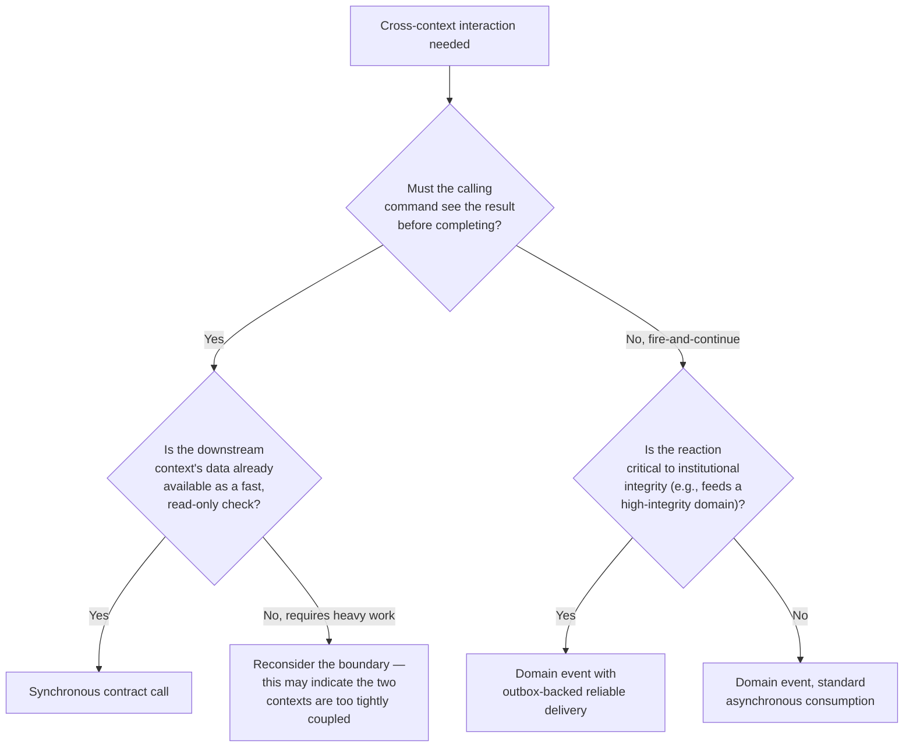

# PMMS Internal Integration Architecture

**Status:** Draft Complete — Pending Architecture, Security, and Engineering Validation
**Related:** [laravel-architecture.md](laravel-architecture.md) · [context-map.md](context-map.md) · [event-and-queue-architecture.md](event-and-queue-architecture.md)

This document defines how bounded-context modules within the single Laravel codebase integrate with each other. It is the runtime implementation of the DDD relationship patterns already established in [context-map.md](context-map.md) (Customer-Supplier, Anti-Corruption Layer, Published Language, Open Host Service, Partnership) — Phase 0.4 does not redefine those relationships, it defines the technical mechanism each one uses.

---

## 1. Permitted Integration Patterns

| Pattern | When Used | Example |
|---|---|---|
| **Direct application-service call within the same context** | Two use cases within one module | `SubmitCompetitionEntry` calling an internal validation service, both within Competition Entries |
| **Synchronous contract call across contexts** | An immediate response is required before the calling command can complete | `SubmitCompetitionEntry` (BC-11) synchronously checks Eligibility's (BC-09) exposed "is cleared" contract before confirming |
| **Domain event for a completed business fact** | The producing context's work is done and downstream contexts should react, not gate the producer | `ResultCertified` (BC-16) triggering Medal Tally (BC-18) recalculation |
| **Asynchronous integration event for downstream processing** | The reaction is non-critical or expensive | `AthleteRegistered` triggering a queued welcome notification |
| **Read-model consumption for cross-domain dashboards** | A report needs data from several contexts | BC-33 Reporting consuming projections from BC-05, BC-21–27 |
| **Anti-corruption adapter for external systems** | A future external integration (Section on deferred integrations) | A translation layer between a future DepEd registry feed and BC-03 Organization Directory |
| **File-based import through controlled ingestion** | Bulk historical data load | A validated CSV import of prior delegation rosters, per [Phase 0.1 product-scope.md, Section 14](../00-product/product-scope.md#14-data-migration-scope) |
| **Webhooks for approved external notifications** | An external system needs to be told something happened | Not currently used — no external integrations are approved yet (Section 4) |

## 2. Discouraged Patterns

- **Cross-context ORM relationships as default integration** — a `TournamentManagement` Eloquent model must not define a `belongsTo` relationship directly into `Scoring`'s tables; the two contexts communicate through their Application-layer contracts.
- **Shared mutable tables** — no two bounded-context modules write to the same table.
- **Direct SQL across bounded contexts** — a report or job must not issue a raw query joining across two contexts' schemas as a substitute for using their exposed read models.
- **Event-listener chains with hidden workflows** — see [laravel-architecture.md, Section 6](laravel-architecture.md#6-workflow-orchestration); any workflow spanning more than one reactive step needs an explicit, documented orchestrator, not an undocumented chain of listeners triggering further listeners.
- **Generic global service classes** — a `UtilityService` or `HelperService` that accumulates unrelated cross-context logic over time is exactly the anti-pattern the Shared Kernel discipline (Section 8 of [laravel-architecture.md](laravel-architecture.md)) exists to prevent.
- **Calling frontend endpoints from backend modules** — backend-to-backend integration never round-trips through an Inertia/HTTP endpoint meant for the browser.
- **Using queues as a substitute for domain design** — a queue moves *when* work happens, not *whether* two contexts should be coupled at all; queuing a cross-context call does not excuse skipping the Application-layer contract.

## 3. Choosing a Pattern

## 4. External Integration Status

**No external integrations are currently approved.** Per [Phase 0.1 product-scope.md, Section 8](../00-product/product-scope.md#8-deferred-integrations), integrations with a DepEd organization registry, learner information systems, payment gateways, SMS/email gateways, and external sports federation systems are all deferred. This document establishes the **pattern** (anti-corruption adapter) any future integration would use — it does not invent a specific integration requirement, consistent with working rule 29.

## 5. Cross-Context Contract Discipline

- Every synchronous cross-context call is defined as an explicit **Application-layer contract** (an interface the upstream context implements and the downstream context depends on) — never an ad hoc method call into another module's internals.
- Contracts are owned by the **upstream** (Customer-Supplier "Supplier") context, per [context-map.md](context-map.md) — the context whose data is authoritative defines the shape other contexts consume.
- Anti-Corruption Layer relationships (Medical Operations → Eligibility, Scoring → Official Results, per [context-map.md, "Anti-Corruption Layers"](context-map.md#anti-corruption-layers--explicit-justification)) are implemented as a dedicated translation component in the **downstream** context's Infrastructure layer — the downstream context protects itself from the upstream context's internal model, not the reverse.
- Published Language relationships (BC-34 Configuration and Reference Data, credential-validity sets from Accreditation to Access Validation) are versioned — a consumer pins to a specific version, so an upstream change cannot silently alter a downstream context's already-recorded decisions (per [context-map.md, "Why Shared Kernel Is Avoided"](context-map.md#why-shared-kernel-is-avoided)).

## 6. Relationship to Domain Events Catalog

Every domain event in [domain-events-catalog.md](domain-events-catalog.md) has an integration pattern assigned here implicitly by its "Consistency" and "Expected Consumers" columns — a `Strong`-consistency event (e.g., `EligibilityApproved`) uses a synchronous contract call or a reliably-delivered event with immediate processing; an `Eventual`-consistency event (e.g., `ScoreRecorded` feeding a public dashboard) uses standard asynchronous queuing. [event-and-queue-architecture.md](event-and-queue-architecture.md) defines the queue-level mechanics for the asynchronous cases.
