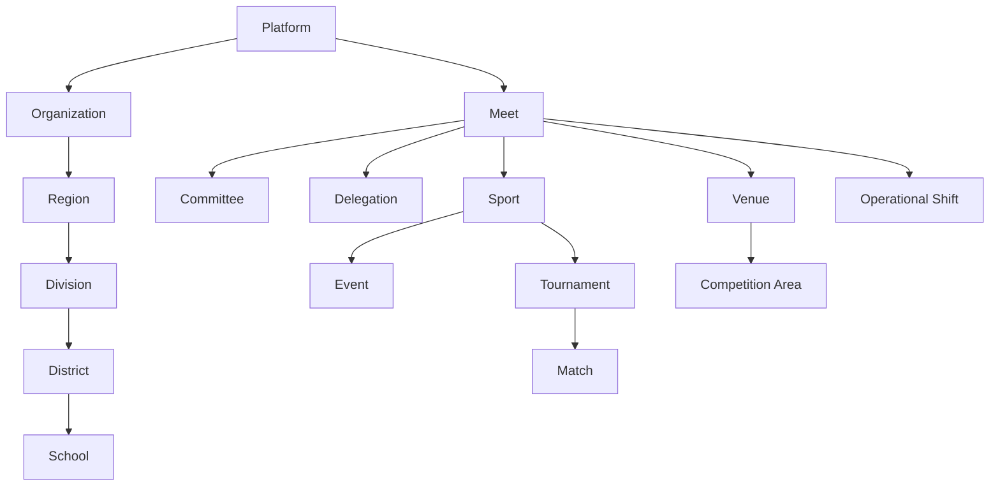

# PMMS Scope Model

**Status:** Draft Complete — Pending Security, Domain, and Stakeholder Validation
**Related:** [phase-0.3-access-and-assignment-architecture.md](phase-0.3-access-and-assignment-architecture.md) · [role-catalog.md](role-catalog.md) · [assignment-model.md](assignment-model.md) · [authorization-decision-model.md](authorization-decision-model.md)

Scope is the boundary within which a Role + Permission combination actually applies. **A role without a scope grants nothing.** This document defines scope types, how they compose, and — critically — where scope does **not** inherit, since most authorization defects come from assuming a broader scope implies a narrower one it does not actually cover.

---

## 1. Scope Hierarchy

Two largely independent hierarchies exist in PMMS, plus several non-hierarchical scope dimensions:

**These two trees do not automatically connect.** An Organization-scoped administrator does not automatically gain Meet-scoped authority, and a Meet is not a child node of the organizational tree in the authorization model even though a Meet has a Host Organization reference (data relationship ≠ scope inheritance — see Rule 2 below).

Non-hierarchical scope dimensions, evaluated independently and combined with the above:

- **Record Ownership Scope** — applies to records created by or explicitly assigned to the requesting user, regardless of organizational/meet position.
- **Data Classification Scope** — Public / Internal / Confidential / Restricted / Highly Restricted (see [phase-0.3, Section 21](phase-0.3-access-and-assignment-architecture.md#21-data-classification-model)) — orthogonal to every hierarchy above.
- **Time Scope** — an assignment's validity window; independent of organizational/meet position.
- **Device Scope** — which physical device an action may be performed from; independent of the above.

## 2. Scope Types (Definitions)

| Scope Type | Applies To | Example |
|---|---|---|
| Platform | The entire PMMS platform | Platform Administrator |
| Organization | One onboarded organization (tenant) | DepEd itself |
| Region | One DepEd region | Region III |
| Division | One Schools Division Office | Division of Bulacan |
| District | One district (where applicable) | — |
| School | One school | A specific participating school |
| Meet | One athletic meet | Provincial Meet 2027 |
| Committee | One committee within one meet | Secretariat, Meet 2027 |
| Delegation | One delegation within one meet | Delegation of School X, Meet 2027 |
| Sport | One sport within one meet | Basketball, Meet 2027 |
| Event | One specific event/category | 100m Boys 16-U, Meet 2027 |
| Venue | One physical venue | Main Stadium |
| Competition Area | One court/track/field/station within a venue | Court 2 |
| Tournament | One configured tournament/bracket/heat group | Basketball Boys Bracket |
| Match | One specific match/heat | Match #14 |
| Shift | One operational time window | July 15, 6am–2pm |
| Record Ownership | Records created/assigned to the requester | "My submitted registrations" |
| Data Classification | A named sensitivity tier | Restricted |

## 3. Scope Composition and Intersection

Most real permissions require **more than one scope dimension simultaneously** — this is the norm, not the exception:

- `official-result.certify` requires **Meet ∩ Sport ∩ Event** — a Result Certifier assigned to Athletics Track Events cannot certify a Basketball result even within the same meet.
- `access-scan.validate` requires **Venue ∩ Device ∩ Shift** — the narrowest composite scope in the platform (see [role-catalog.md, ROLE-48](role-catalog.md#role-48--access-control-operator)).
- `medical-encounter.view-sensitive` requires **Committee (Medical) ∩ Record Ownership-adjacent (need-to-know)** — even within the Medical committee, "assigned to this venue's shift" further narrows access.
- `eligibility-case.approve` requires **Meet ∩ Delegation (assigned subset)** — an Eligibility Approver assigned to Delegations A–D cannot approve a case for Delegation E.

## 4. Scope Inheritance Rules

Per working rule 20 ("require explicit scope evaluation for sensitive actions") and the Phase 0.1 operating model, scope inheritance is **narrow and explicit**, not assumed broad-to-narrow:

| Does This Inherit? | Answer |
|---|---|
| Platform scope → automatically bypasses data-classification restrictions | **No.** A Platform Administrator still cannot view Highly Restricted medical data without a specific Medical-domain grant. |
| Organization scope → automatically grants meet authority | **No.** Organization Administrator ≠ Meet Director; these are separate assignments. |
| Meet scope → automatically grants all sport access | **No.** A Meet Administrator does not automatically gain Tournament Manager authority for every sport. |
| Committee scope → automatically grants access to other committees | **No.** Medical committee membership grants nothing in Finance, and vice versa. |
| Sport scope → automatically includes result certification | **No.** A Tournament Manager (Sport scope) does not automatically hold `official-result.certify` — that requires the separate Result Certifier assignment (explicit anti-pattern from working rules). |
| Venue scope → grants authority over all events held at the venue | **No.** Venue scope governs venue-operational actions (access, logistics); it does not grant Sport/Event-scoped competition authority. |
| Delegation scope → allows modifying another delegation | **No.** Never. Delegation scope is always the requester's own assigned delegation(s) only. |
| Record ownership → overrides approval separation | **No.** Creating a record does not grant approval authority over it — this is precisely what Separation of Duties exists to prevent (see [separation-of-duties-matrix.md](separation-of-duties-matrix.md)). |
| Public scope → permits anything beyond published projections | **No.** Public scope is read-only and limited to BC-29's approved projections, full stop. |

**Corollary:** Multiple scopes may be required for one action (Section 3), and no single broad scope grant is ever a substitute for the specific narrower scopes a sensitive action requires.

## 5. Scope Expiry

Scope is only as valid as the Assignment that grants it (see [assignment-model.md](assignment-model.md)). When an assignment's validity window ends, expires, or is revoked, **the associated scope must immediately cease to apply to effective authority** — there is no grace period for sensitive actions (see [authorization-decision-model.md](authorization-decision-model.md)). Non-sensitive, session-level effects (e.g., a currently-open UI screen) may need a brief propagation window, which is an implementation-phase concern, not an architectural exception to this rule.

## 6. Scope Conflict

A scope conflict arises when a user holds two assignments whose scopes overlap in a way that could produce contradictory authority (e.g., assigned as both Eligibility Reviewer and Eligibility Approver for the *same* delegation, which the Separation of Duties rule (SOD-01) prohibits at the case level). Scope conflict detection is a validation concern at assignment-creation time (see [assignment-model.md, Section "Assignment Conflicts"](assignment-model.md#assignment-conflicts)), not resolved silently by the authorization engine at request time — a conflicting assignment should not be created in the first place, or should be flagged for review if it already exists.

## 7. Public Scope

Public scope is the simplest and most restrictive scope in the model: it grants read access to exactly the set of projections BC-29 Public Information has been given by upstream authoritative contexts (see [reporting-and-read-model-boundaries.md](reporting-and-read-model-boundaries.md)), and nothing else. Public scope never composes with any other scope to produce broader access — it is a ceiling, not a floor.

## 8. Cross-Meet Isolation

A user's assignment to Meet A grants **no** authority whatsoever within Meet B, even if the user holds the identical role (e.g., Tournament Manager) in both. Each meet requires its own explicit assignment (see [Example 1](phase-0.3-access-and-assignment-architecture.md#example-1) in the main document). This directly supports the Phase 0.1 multi-meet operating model and prevents a single compromised or over-broad assignment from cascading across meets.

## 9. Cross-Organization Isolation

Not currently a live concern (PMMS's initial scope is DepEd-only per [Phase 0.1 OD-02](../00-product/open-decisions.md#od-02--single-organization-versus-multi-organization)), but the scope model is designed so that, if a second Organization is onboarded in the future, no scope automatically crosses the Organization boundary — this is the same principle as cross-meet isolation, one level up the hierarchy. See [domain-open-decisions.md, DD-21](domain-open-decisions.md#dd-21--tenant-boundaries).

## 10. Example Evaluation Scenarios

| Scenario | Scopes Required | Held By User? | Result |
|---|---|---|---|
| A Tournament Manager (Basketball, Meet 2027) attempts to schedule a Volleyball match in Meet 2027 | Sport = Volleyball | No (holds Sport = Basketball only) | **Denied** — sport scope mismatch |
| A Delegation Head (School X) attempts to view School Y's roster | Delegation = School Y | No (holds Delegation = School X only) | **Denied** — delegation scope mismatch |
| An Eligibility Reviewer (Delegations A–D) attempts to review a case for Delegation C | Meet + Delegation ∈ {A,B,C,D} | Yes | **Allowed**, subject to further checks (resource state, SoD) |
| A Meet Administrator attempts to view a Medical encounter | Committee = Medical | No | **Denied** — meet scope does not grant committee scope |
| An Access Control Operator (Gate 2, Shift AM) attempts to scan at Gate 5 | Device = Gate 5 scanner | No (holds Device = Gate 2 scanner only) | **Denied** — device scope mismatch |
| A Result Certifier (Athletics, Track Events) attempts to certify a Field Events result | Event ∈ Track Events | No (Field Events not in assignment) | **Denied** — event scope mismatch |
| A Platform Administrator attempts to view a Restricted finance record | Data Classification = Restricted, Committee = Finance | No — platform scope does not bypass classification | **Denied** |
| A public (anonymous) visitor requests a published result | Public scope, Published state | Yes (by definition) | **Allowed** |

## 11. Open Questions

- Whether District-level scope is needed at all, or collapses into Division scope for PMMS's purposes (depends on [Phase 0.1 OD-04](../00-product/open-decisions.md#od-04--delegation-hierarchy)).
- Precise Competition Area vs. Venue scope boundary for sports with multiple simultaneous competition areas at one venue.
- Whether Shift scope needs to be a first-class, reusable concept or can remain an attribute of specific Assignments only (leaning toward the latter — see [assignment-model.md](assignment-model.md)).

Tracked in [access-open-decisions.md](access-open-decisions.md).
