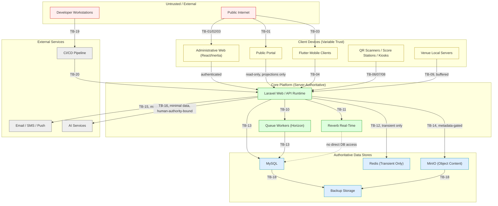

# PMMS Trust Boundaries and Attack Surface

**Status:** Draft Complete — Pending Security, Privacy, Legal, Audit, Data Governance, and Engineering Validation
**Related:** [threat-model.md](threat-model.md) · [security-architecture.md](security-architecture.md) · [../01-architecture/phase-0.4-application-integration-runtime-architecture.md](../01-architecture/phase-0.4-application-integration-runtime-architecture.md)

This document defines PMMS's trust boundaries — the points where data or control crosses from one trust level to another — and enumerates the platform's attack surface. **No firewall, network, or infrastructure configuration is created here.**

---

## 1. Trust Boundaries

| Boundary | Between | Why It's a Boundary |
|---|---|---|
| TB-01 | Public internet ↔ Public portal | Fully untrusted external traffic reaching PMMS's only unauthenticated surface |
| TB-02 | Public internet ↔ Administrative web (React/Inertia) | Untrusted traffic reaching an authenticated surface — authentication is the boundary control |
| TB-03 | Public internet ↔ API runtime | Untrusted traffic reaching mobile/device/integration APIs |
| TB-04 | Flutter mobile clients ↔ API runtime | A client PMMS does not physically control, running on hardware of varying trust |
| TB-05 | Offline mobile local stores ↔ synchronized server state | Data captured outside real-time server validation, reconciled later |
| TB-06 | QR scanner devices ↔ Access Validation runtime | Purpose-restricted devices with narrow, high-volume trust |
| TB-07 | Score-entry stations ↔ Scoring runtime | Purpose-restricted devices feeding a Critical high-integrity domain |
| TB-08 | Kiosks / scoreboard devices ↔ Public Information runtime | Read-only devices that must never gain write trust |
| TB-09 | Venue local servers ↔ Core Laravel Application | A connectivity-loss buffering point, not an independent authority |
| TB-10 | Laravel web/API runtime ↔ Queue workers | Deferred execution crossing from request-time to background-time trust |
| TB-11 | Laravel runtime ↔ Reverb | Real-time broadcast crossing from server-authoritative state to a transient public/private channel |
| TB-12 | Laravel runtime ↔ Redis | Application ↔ transient-store boundary — Redis must never be treated as equally trusted as MySQL |
| TB-13 | Laravel runtime ↔ MySQL | Application ↔ authoritative-store boundary |
| TB-14 | Laravel runtime ↔ MinIO | Application ↔ object-content boundary — object bytes are never self-authorizing |
| TB-15 | Laravel runtime ↔ external email/SMS/push services | Data leaving PMMS's own trust boundary to a third party |
| TB-16 | Laravel runtime ↔ AI services | Data leaving PMMS's own trust boundary to an AI provider, with the added risk of adversarial input (prompt injection) |
| TB-17 | Laravel runtime ↔ external integrations | Currently none approved (per [../01-architecture/internal-integration-architecture.md, Section 4](../01-architecture/internal-integration-architecture.md#4-external-integration-status)) — any future integration is a new boundary requiring its own review |
| TB-18 | Production data ↔ backup storage | A secondary copy of every asset, requiring equal or greater protection |
| TB-19 | Developer workstations ↔ source control (GitHub) | Where code and (accidentally) secrets could leak |
| TB-20 | CI/CD ↔ production deployment | Automated pipeline trust — a compromised pipeline is a path to production compromise |
| TB-21 | Production administration ↔ production data | The most consequential boundary — privileged human access to everything |

## 2. Trust Boundary Diagram

## 3. Attack Surface Inventory

| Surface | Category | Notes |
|---|---|---|
| Login | Authentication | Fortify-based; credential-stuffing and brute-force targets |
| Password reset | Authentication | Token-based; account-takeover target |
| Account recovery | Authentication | Owned by Identity and Access (BC-02) |
| MFA | Authentication | 2FA readiness present in starter kit; enforcement scope is an open decision |
| Session cookies | Session | `http_only`, `same_site=lax` by framework default; `secure` flag environment-driven |
| Mobile tokens | API/Mobile | Distinct from web session cookies |
| API tokens | API | Scoped, revocable per [../01-architecture/api-and-client-boundaries.md](../01-architecture/api-and-client-boundaries.md) |
| Device credentials | Device | Scanner/encoder/kiosk identity, per [../01-architecture/device-and-service-identity-model.md](../01-architecture/device-and-service-identity-model.md) |
| QR tokens | Device | Access-validation credential surface |
| Upload endpoints | Application | File-upload abuse surface, per [file-object-storage-and-malware-security.md](file-object-storage-and-malware-security.md) |
| Download endpoints | Application | Object-retrieval authorization surface |
| Signed URLs | Storage | Time-boxed MinIO access surface |
| Public search | Public | Data-scraping and enumeration surface |
| Public APIs | Public | Bulk-access and abuse surface |
| Webhooks | Integration | Currently none approved; future surface per [../03-security/application-api-and-client-security.md](application-api-and-client-security.md) |
| Reverb channels | Real-time | Public/private/presence channel-authorization surface |
| Queue payloads | Background | Payload-content and re-validation surface |
| Redis | Infrastructure | Never publicly exposed; internal-network surface only |
| MinIO | Infrastructure | Never publicly exposed directly; internal-network + signed-URL surface |
| Database accounts | Infrastructure | Application/migration/reporting account-separation surface |
| Import files | Data | Bulk-ingestion abuse surface |
| Export files | Data | Bulk-exfiltration surface |
| Report generation | Data | Same as export, plus rendering-engine surface |
| Admin tools | Application | Horizon dashboard and any future admin-only tooling |
| Impersonation | Privileged access | Support-impersonation surface, per SOD-11 |
| Break-glass access | Privileged access | Currently unresolved necessity (AD-10) |
| Support procedures | Privileged access | Read-access and data-repair surface |
| AI prompts and data exchange | AI | Prompt-injection and data-leakage surface |
| CI/CD and dependencies | Supply chain | Pipeline-compromise and dependency-compromise surface |

## 4. Relationship to Control Domains

Every attack-surface row above maps to at least one control domain in [security-architecture.md, Section 4](security-architecture.md#4-control-domain-model) and at least one document in this package — the detailed controls for each surface are documented there, not duplicated here. This document exists to ensure no surface is silently unaccounted for.

## 5. Open Questions

See [security-open-decisions.md](security-open-decisions.md) — notably whether public API rate-limiting thresholds and webhook-signing requirements can be finalized before a specific external integration is approved.
