# PMMS AI Platform and Service Architecture

**Status:** Draft Complete — Pending AI, Security, Privacy, Domain, Sports, Quality, and Engineering Validation
**Related:** [../01-architecture/phase-0.4-application-integration-runtime-architecture.md](../01-architecture/phase-0.4-application-integration-runtime-architecture.md) · [ai-gateway-provider-and-model-abstraction.md](ai-gateway-provider-and-model-abstraction.md)

This document defines the conceptual AI platform components every capability in this package is built on. **No component in this document is implemented** — restated per working rule 6.

---

## 1. Conceptual Components

| Component | Responsibility |
|---|---|
| AI Gateway | Central entry point for every AI request — per [ai-gateway-provider-and-model-abstraction.md, Section 1](ai-gateway-provider-and-model-abstraction.md#1-ai-gateway) |
| AI Request Policy Engine | Evaluates whether a request is permitted given the requesting user's authority and the capability's risk tier |
| Context and Authorization Resolver | Resolves the requesting user's role, permission, assignment, scope, and classification into the AI request's effective boundary — restated from [../01-architecture/authorization-decision-model.md](../01-architecture/authorization-decision-model.md) |
| Data Minimization Layer | Assembles only the specific records/fields a request needs, per [ai-security-privacy-and-data-minimization.md](ai-security-privacy-and-data-minimization.md) |
| Prompt Registry | Versioned, reviewed prompt storage, per [prompt-context-and-structured-output-architecture.md, Section 2](prompt-context-and-structured-output-architecture.md#2-prompt-registry) |
| Knowledge Retrieval Service | Executes the RAG lifecycle, per [retrieval-knowledge-and-semantic-search-architecture.md](retrieval-knowledge-and-semantic-search-architecture.md) |
| Model Provider Adapter | Provider-neutral interface to hosted or local models, per [ai-gateway-provider-and-model-abstraction.md, Section 2](ai-gateway-provider-and-model-abstraction.md#2-provider-and-model-abstraction) |
| Structured Output Validator | Confirms an AI response matches its required schema before it reaches a human reviewer |
| Safety and Policy Filter | Screens for prompt-injection indicators, unsafe content, and policy violations before and after model invocation |
| Citation and Provenance Service | Attaches source references to every grounded output, per [policy-rulebook-and-source-governance.md](policy-rulebook-and-source-governance.md) |
| Human Review Workflow | Implements the human-in-the-loop lifecycle, per [human-in-the-loop-and-authority-model.md](human-in-the-loop-and-authority-model.md) |
| AI Audit Service | Records every AI request/response/disposition, per [ai-identity-authorization-scope-and-audit.md](ai-identity-authorization-scope-and-audit.md) |
| Evaluation Service | Runs golden-dataset and regression evaluation, per [ai-evaluation-testing-and-quality-assurance.md](ai-evaluation-testing-and-quality-assurance.md) |
| Cost and Quota Service | Enforces per-user/organization/meet/capability budgets, per [ai-observability-cost-quotas-and-operations.md, Section 2](ai-observability-cost-quotas-and-operations.md#2-cost-and-quota-management) |
| AI Feature Flag Service | Enables per-capability, per-environment enable/disable, per [../05-devops/configuration-feature-flag-and-secret-management.md, Section 4](../05-devops/configuration-feature-flag-and-secret-management.md#4-feature-flag-architecture) |
| AI Observability | Metrics, logs, and alerting specific to AI operation, per [ai-observability-cost-quotas-and-operations.md](ai-observability-cost-quotas-and-operations.md) |

## 2. Conceptual Request Flow

```mermaid
flowchart LR
    User["Requesting User\n(Authenticated, Authorized)"] --> Gateway["AI Gateway"]
    Gateway --> Policy["Request Policy Engine"]
    Policy --> Auth["Context & Authorization\nResolver"]
    Auth --> Minimize["Data Minimization Layer"]
    Minimize --> Retrieve["Knowledge Retrieval\nService"]
    Retrieve --> Prompt["Prompt Registry\n(versioned)"]
    Prompt --> Provider["Model Provider Adapter"]
    Provider --> Validate["Structured Output\nValidator"]
    Validate --> Safety["Safety & Policy Filter"]
    Safety --> Citation["Citation & Provenance\nService"]
    Citation --> Review["Human Review Workflow"]
    Review -->|Accept / Edit| App["Ordinary Application\nCommand/Query Path"]
    Review -->|Reject / Escalate| Audit["AI Audit Service"]
    App --> Audit
    Gateway -.->|every step| Audit
    Gateway -.->|every step| Observability["AI Observability"]
```

This diagram is conceptual — it names the responsibility boundaries this architecture requires, not an implementation topology.

## 3. Relationship to Phase 0.4 Application Architecture

This platform's components sit within the existing Phase 0.4 application boundary, never alongside or outside it — restated from [../01-architecture/phase-0.4-application-integration-runtime-architecture.md, Section 34](../01-architecture/phase-0.4-application-integration-runtime-architecture.md#34-ai-service-integration-boundary): "an AI feature's effective database access is never broader than what it needs for the specific request." Every component above operates as a specialization of the existing Application layer, not a parallel system with its own independent data access.

## 4. Relationship to the AI Gateway

Every AI capability in this package is required to route through the AI Gateway (Section, [ai-gateway-provider-and-model-abstraction.md, Section 1](ai-gateway-provider-and-model-abstraction.md#1-ai-gateway)) or an equivalent controlled application boundary — restated absolutely; no capability calls a model provider directly, bypassing the policy engine, authorization resolver, or audit service.

## 5. Open Questions

See [ai-open-decisions.md](ai-open-decisions.md) — notably which of these conceptual components are built as genuinely separate services versus consolidated into the existing Laravel application's Application layer for the initial implementation.
