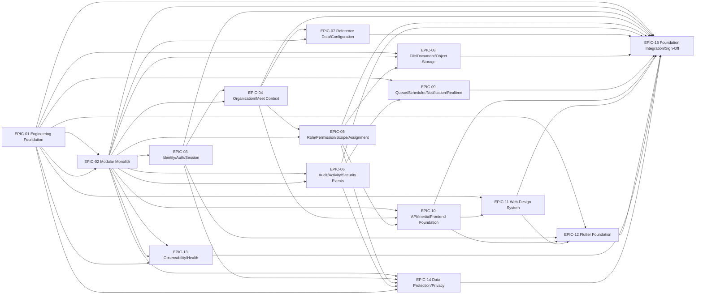

# PMMS Phase 1 Dependency Map

**Status:** Draft Complete — Pending Backlog, Architecture, Product, Quality, and Engineering Review
**Related:** [phase-1-execution-sequence.md](phase-1-execution-sequence.md), [phase-1-work-package-catalog.md](phase-1-work-package-catalog.md)

## 1. Epic-Level Dependencies

## 2. Work-Package-Level Dependencies (Hard Only)

Full per-work-package dependency classification (Hard/Soft/Deferred) lives in each work package's own Section 6. This table summarizes only cross-epic hard dependencies not already implied by the epic graph above:

| Downstream Work Package | Hard Dependency On | Reason |
|---|---|---|
| WP-04-07 | WP-09-02 | Context propagation into jobs/events requires the queue baseline to exist first. |
| WP-05-11 | WP-10-01..09, WP-11-01..10 | Administration UI needs both the API/Inertia contract and design-system components. |
| WP-06-07 | WP-10-01..09 | Audit review interface needs the API/Inertia contract. |
| WP-07-10 | WP-10-01..09 | Reference-data administration UI needs the API/Inertia contract. |
| WP-08-04 | WP-14-01 | File validation/classification needs data-classification constants. |
| WP-08-06 | WP-05-07 | Authorized/signed download needs the Authorization Decision Service. |
| WP-08-10 | WP-06-06 | File audit events need the Audit Recording Service. |
| WP-09-07 | WP-06-01 | Notification foundation needs the audit event model for delivery-attempt logging. |
| WP-09-10 | WP-05-07 | Private channel authorization needs the Authorization Decision Service. |
| WP-10-03 | WP-04-06, WP-05-07 | Inertia shared props need trusted context propagation and authorization. |
| WP-10-04 | WP-14-01 | Sensitive-prop minimization needs data-classification constants. |
| WP-11-01 | WP-01-03 | Design tokens need the frontend quality-tool baseline verified first. |
| WP-11-04 | WP-10-05 | Application shell needs the frontend permission/capability contract. |
| WP-11-05 | WP-04-04 | Context switcher needs user-meet-access data. |
| WP-12-03 | WP-10-01 | Flutter API configuration needs the backend response/error contract. |
| WP-12-05 | WP-03-02 | Flutter authentication shell needs the web authentication flow baseline as its contract reference. |
| WP-12-06 | WP-05-07 | Assignment-aware mobile home needs the Authorization Decision Service. |
| WP-12-07 | WP-11-01 | Flutter theme needs the web design tokens as its source of truth. |
| WP-13-05 | WP-09-02 | Queue health needs the queue/Horizon baseline. |
| WP-13-06 | WP-09-09 | Reverb health needs the Reverb baseline. |
| WP-13-07 | WP-08-01 | Storage health needs the storage-configuration abstraction. |
| WP-13-08 | WP-14-03 | Safe error reporting needs log redaction. |
| WP-14-03 | WP-13-01 | Log redaction needs structured logging to redact within. |
| WP-14-07 | WP-03-03 | CSRF/session review needs session security to already exist. |
| WP-14-09 | WP-05-07, WP-06-06 | Support/impersonation restriction needs both authorization and audit recording. |

## 3. Hard vs. Soft vs. Policy vs. Infrastructure vs. Review Dependencies

- **Hard dependencies:** listed above and in each work package's Section 6 — implementation cannot proceed without the predecessor's Definition of Done being met.
- **Soft dependencies:** named in Section 16 of the main backlog document (e.g., DV-01 deployment topology for WP-01-06, DX-01 WCAG target for WP-11-12/WP-12-12, PSG-03 retention for WP-06-08) — foundation work proceeds without them, with the affected constraint explicitly flagged.
- **Policy dependencies:** none within Phase 1 scope — every policy-blocked module is excluded (Section 17 of the main document).
- **Infrastructure dependencies:** local development environment only for Phase 0.14-era execution (SQLite acceptable for early work packages per repository baseline); MySQL/Redis/MinIO-compatible services required starting at WP-09-01 and WP-08-01 respectively, per the approved technology direction — provisioning method (Docker Compose vs. other) is a WP-01-06 decision, not a Phase 0.14 decision.
- **Review dependencies:** every work package names required reviewers in its Section 1; EPIC-15 additionally requires the full candidate reviewer set from [../10-review/architecture-review-methodology-and-evidence-model.md, "6. Reviewer Roles"](../10-review/architecture-review-methodology-and-evidence-model.md#6-reviewer-roles-candidate-not-assigned).

## 4. Cycles or Conflicts

No circular dependency was found among the 155 work packages or 15 epics. One near-cycle risk was identified and resolved during decomposition: EPIC-05 (Authorization) and EPIC-10 (API/Frontend) both depend on each other conceptually (authorization decisions shape the frontend capability contract; the frontend needs a stable contract to consume). This is resolved by sequencing WP-05-07 (Authorization Decision Service) strictly before WP-10-05 (Frontend Permission and Capability Contract) — EPIC-10 depends on EPIC-05's service existing, not the reverse.

## 5. Readable Summary

The dependency graph has one true entry point (WP-01-01) and one true exit gate (WP-15-12). Between them, five release groups (A–E) fan out into largely parallel epic tracks that converge only at Release F. No epic other than EPIC-15 depends on more than three other epics directly, keeping the graph shallow and each epic independently reviewable, consistent with working rule 41.
