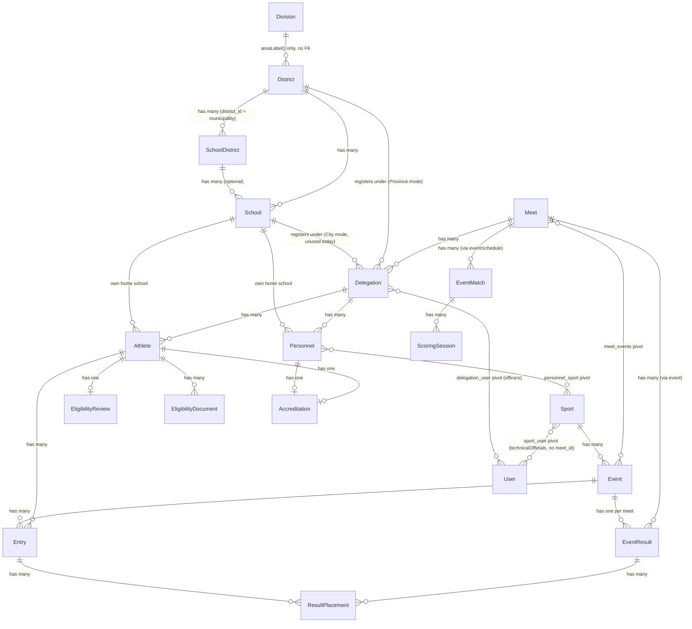
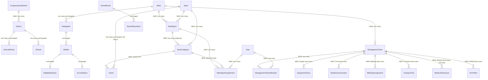

# PMMS Relationship Map

Companion to [pmms-organizational-realignment-gap-assessment.md](../reports/architecture/pmms-organizational-realignment-gap-assessment.md) and [pmms-approved-organizational-model.md](pmms-approved-organizational-model.md). Two diagrams: **current** (verified against the running schema) and **target** (proposed, additive). New entities are marked `NEW`; everything else exists today exactly as drawn.

## Current state (verified)

Key facts this diagram makes visible:
- `Sport` has no edge to `Meet` at all — it only reaches a meet indirectly through `Event`.
- `sport_user` (Technical Official assignment) hangs off `Sport` directly, not off any meet-scoped entity — this is the "global, not meet-specific" gap from the gap assessment §7/§9, drawn here as the one relationship in this diagram with no meet in its path.
- `District` has two incoming "delegation registers under" edges (School and District) because the schema supports both division types; only the `District` edge is active for this deployment (Province/Davao de Oro).

## Target state (proposed, additive)

Everything not shown as `NEW` in this second diagram is identical to the current-state diagram — the target model does not remove or rewire any existing edge; it only adds new nodes and edges around them (`MeetSport` sitting between `Meet`/`Sport`, `ManagementTeam` as the new anchor for six operational subtrees).

## Reading guide

- An edge in the target diagram that has no `NEW` label but touches a `NEW` node (e.g. `Sport ||--o{ MeetSport`) means: the existing entity (`Sport`) is untouched, only the new table's foreign key into it is added — the existing table gains no new column from that edge.
- `sport_user` (current-state diagram) is not carried into the target diagram — per the migration plan, it is retired once `MeetSportAssignment` (role = 'Technical Official') fully replaces its one consumer, `ScoringSessionController::canManage()`. It is not shown as removed above because that retirement happens in a later, separate migration, not the same one that introduces `MeetSportAssignment`.
- `Person`/unified identity (mandate §27) is deliberately **absent** from the target diagram — flagged as Open Question OQ-1 in the approved organizational model, not a designed-and-pending entity.
